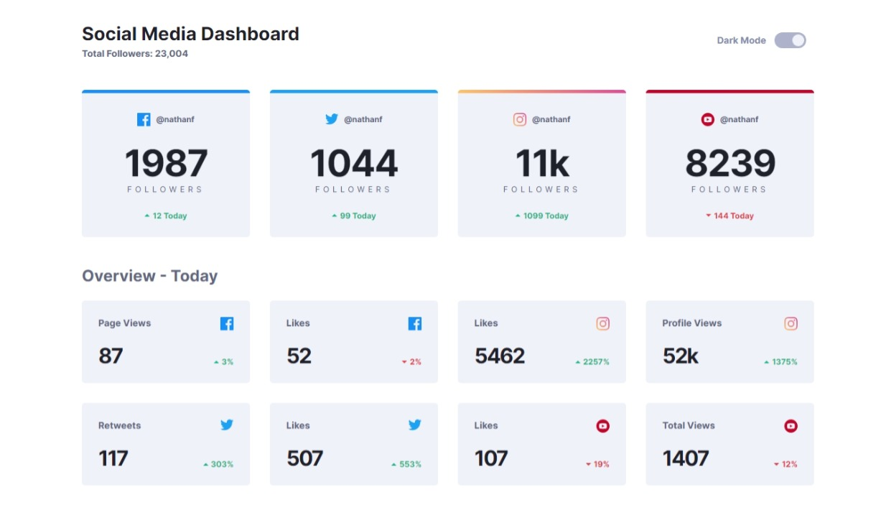
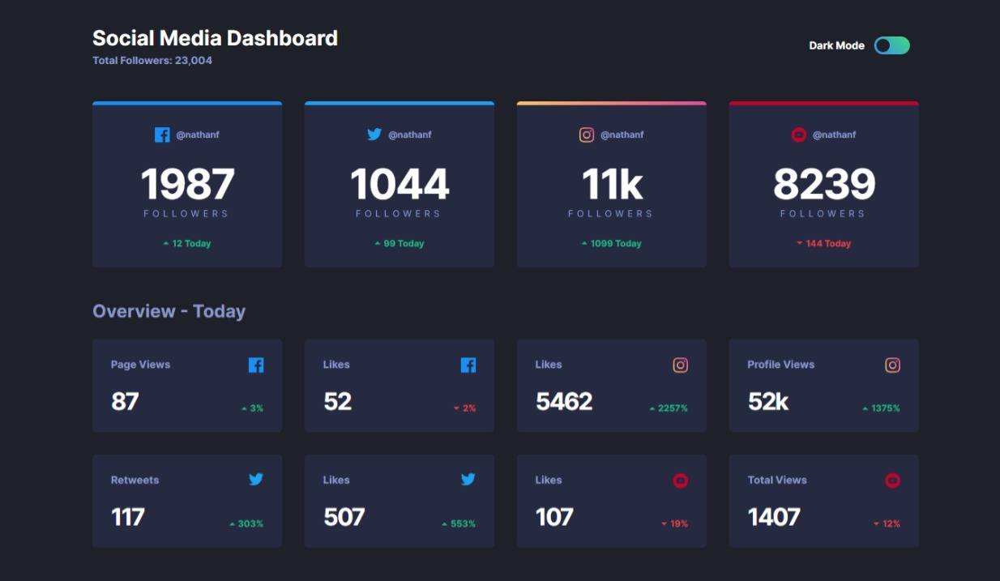

# Social Dashboard


Simple social dashboard clone created using HTML5, SASS, Javascript, and Vite.

## Prerequisites

Before you can run this project, you need to have the following installed:

- Node.js (version 18.0 or later)

## Project Setup

To install this project, follow these steps:
Clone the repository using `git`

```
git clone https://github.com/Prakashdeveloper03/Netflix-Clone.git
```

Navigate to the root directory of the project

```
cd <directory_name>
```

Install all required packages

```sh
pnpm install
```

Compile and Hot-Reload for Development

```sh
pnpm run dev
```

## Screenshot
### Light Mode


### Dark Mode
